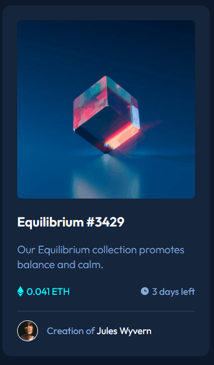

# Projeto do Frontend Mentor
Brief
Your challenge is to build out this preview card component and get it looking as close to the design as possible.

Your users should be able to:
View the optimal layout depending on their device's screen size
See hover states for interactive elements💢

Seu desafio é construir este componente de cartão de visualização e fazê-lo parecer o mais próximo possível do design. 
Veja o layout ideal dependendo do tamanho da tela do dispositivo
Veja os estados de foco para elementos interativos

## Tecnologias utilizadas
- HTML
- CSS
